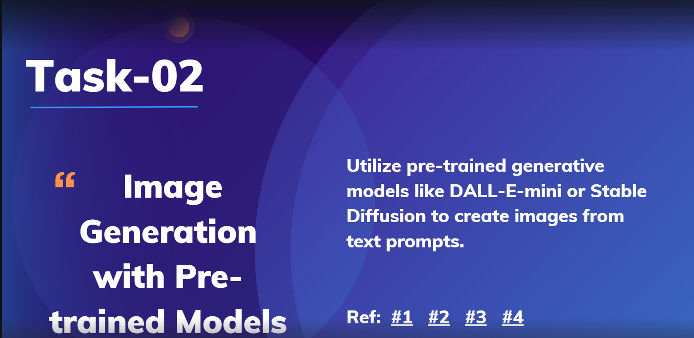

# 🎨 Task-02: Image Generation with Pre-Trained Models

This project demonstrates how to use pre-trained generative models, such as **DALL-E-mini** and **Stable Diffusion**, to create images from text prompts. These models allow users to generate stunning images simply by describing them in text, leveraging cutting-edge generative AI.

## 📑 Table of Contents
- [✨ Overview](#-overview)
- [🔧 Setup Instructions](#-setup-instructions)
- [🖼️ Generating Images](#️-generating-images)
- [💡 Optional Enhancements](#-optional-enhancements)
- [📸 Results](#-results)
- [📚 References](#-references)

---

## ✨ Overview

This task involves:
- 🎨 Utilizing pre-trained generative models like **DALL-E-mini** or **Stable Diffusion** to create images from text prompts.
- 📐 Experimenting with different image aspect ratios using **VQGAN+CLIP**.
- 🚀 Applying performance optimizations like **XLA compilation** and **mixed precision computation** for faster image generation.



## 🔧 Setup Instructions

To get started, follow these steps:

1. **Open Google Colab** 📓: Google Colab is recommended for GPU access, which accelerates model inference.
2. **Install Required Libraries**:
   - Run the following command to install the libraries needed for this task:
   
     ```bash
     !pip install transformers torch Pillow diffusers tensorflow keras
     ```

## 🖼️ Generating Images

### 1. 📥 Load a Pre-trained Model

Choose either **DALL-E-mini** or **Stable Diffusion**:

#### A. DALL-E-mini
- DALL-E-mini is efficient for quick image generation.
- Load the model and processor as follows:

  ```python
  from transformers import DalleMiniProcessor, DalleMiniForImageGeneration

  # Initialize processor and model
  processor = DalleMiniProcessor.from_pretrained("dalle-mini")
  model = DalleMiniForImageGeneration.from_pretrained("dalle-mini")
  ```

#### B. Stable Diffusion
- Stable Diffusion produces high-quality, detailed images.
- Load it using Hugging Face’s `diffusers` library:

  ```python
  from diffusers import StableDiffusionPipeline

  # Load Stable Diffusion pipeline
  pipe = StableDiffusionPipeline.from_pretrained("CompVis/stable-diffusion-v1-4")
  pipe.to("cuda")  # Use GPU for faster inference
  ```

### 2. 📝 Generate Images from Text Prompts

Define a descriptive prompt and generate the image:

#### Using DALL-E-mini

```python
prompt = "A futuristic cityscape at sunset"
inputs = processor(prompt, return_tensors="pt")
image = model.generate(**inputs).images[0]
image.show()
```

#### Using Stable Diffusion

```python
prompt = "A futuristic cityscape at sunset"
image = pipe(prompt).images[0]
image.show()
```

### 3. 💾 Save the Generated Image
To save the generated image, use the following:

```python
image.save("generated_image.png")
```

---

## 💡 Optional Enhancements

1. **Aspect Ratio Adjustment**: 📐 Modify the aspect ratio using **VQGAN+CLIP** techniques as described in [this article](https://towardsdatascience.com/e-dall-e-creating-digital-art-with-varying-aspect-ratios-5de260f4713d).
2. **Performance Optimizations**: 
   - Enable **JIT compilation** and **mixed precision** in TensorFlow to speed up generation.
   - Example:
   
     ```python
     import tensorflow as tf
     tf.config.optimizer.set_jit(True)
     tf.keras.mixed_precision.set_global_policy("mixed_float16")
     ```

---

## 📸 Results

Generated images from DALL-E-mini and Stable Diffusion vary in style and detail. Stable Diffusion provides higher-resolution, more detailed images, while DALL-E-mini is suitable for simpler image generation needs.

---

## 📚 References

- [Generate Images with Stable Diffusion - TensorFlow](https://www.tensorflow.org/tutorials/generative/generate_images_with_stable_diffusion)
- [DALL-E Mini Colab Notebook](https://colab.research.google.com/github/robgon-art/e-dall-e/blob/main/DALL_E_Mini_Image_Generator.ipynb)
- [Creating Digital Art with Varying Aspect Ratios - Towards Data Science](https://towardsdatascience.com/e-dall-e-creating-digital-art-with-varying-aspect-ratios-5de260f4713d)
