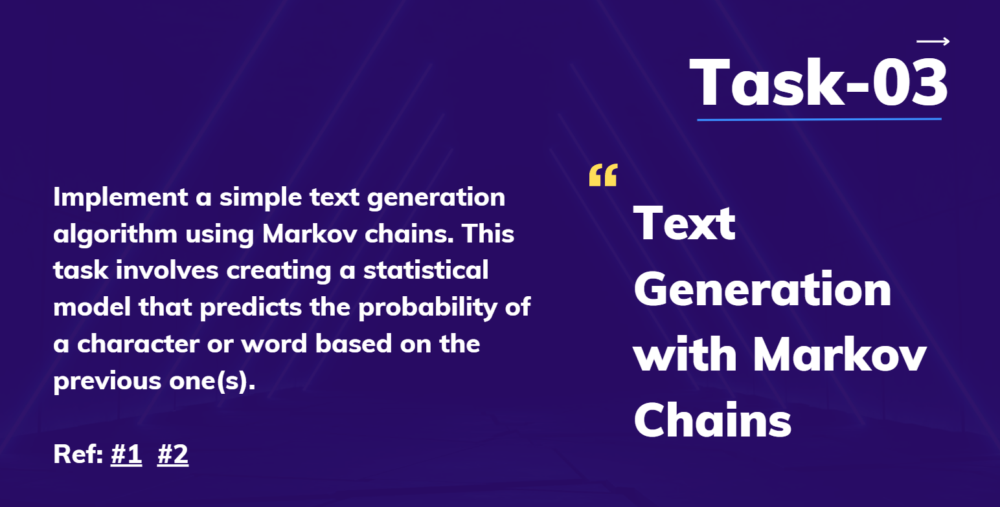

# Task 3: Text Generation with Markov Chains 🔍

This project demonstrates a basic text generation algorithm using **Markov Chains**. By learning the probabilities of word or character sequences, this algorithm generates new text based on the patterns observed in an input text corpus.

## 📑 Table of Contents
- [Task Description](#task-description-)
- [Objectives](#objectives-)
- [Requirements](#requirements-)
- [Implementation Steps](#implementation-steps-)
- [Deliverables](#deliverables-)
- [References](#references-)



## Task Description 📝
The objective of this task is to implement a text generation algorithm based on **Markov Chains**. A Markov Chain is a statistical model that predicts the probability of a character or word based on its preceding character or word. Using these probabilities, the model generates new text by sampling from learned patterns.

## Objectives 🎯

- **Develop a Markov Chain-based text generation model**. 🤖
- **Train the model** on a given corpus of text data. 📚
- **Generate new text** by sampling from the learned probability distributions. 🔮

## Requirements 📋

### Data Preprocessing 🧹
- Clean and preprocess the input text, removing special characters and converting to lowercase.

### Markov Chain Model 📈
- Implement a Markov Chain model that learns transition probabilities between characters or words.

### Text Generation 💬
- Use the trained Markov Chain model to generate new text based on the learned transitions.

### Evaluation 🔍
- Assess the quality and coherence of the generated text.

## Implementation Steps 🛠️

1. **Load and Preprocess Data**: Load and clean the text data, removing unwanted characters and formatting text as needed. 📂
2. **Build Markov Chain Model**: Construct the Markov Chain by calculating transition probabilities between words or characters. 🔗
3. **Text Generation**: Use the model to generate new text based on probability sampling from the learned transitions. 🎨
4. **Evaluation**: Assess the quality of the generated text, looking for coherence and fluidity, and identify possible improvements. 📊

## Deliverables 📦

- **Code**: Submit the code implementing the text generation algorithm using Markov Chains. 💻
- **Documentation**: Provide a README explaining the project, implementation details, and results. 📚
- **Sample Output**: Include examples of generated text to illustrate the algorithm’s performance. 🖼️

## Sample Code (Python)

Here is a simple implementation outline:

```python
import random
import re
from collections import defaultdict

# Load and preprocess data
def preprocess_text(text):
    text = re.sub(r'[^\w\s]', '', text)  # Remove punctuation
    text = text.lower()  # Convert to lowercase
    return text.split()  # Split into words

# Build Markov Chain
def build_markov_chain(words, n=1):
    markov_chain = defaultdict(list)
    for i in range(len(words) - n):
        key = tuple(words[i:i+n])
        next_word = words[i+n]
        markov_chain[key].append(next_word)
    return markov_chain

# Generate text
def generate_text(chain, start, length=50):
    text = list(start)
    for _ in range(length):
        state = tuple(text[-len(start):])
        next_word = random.choice(chain[state]) if state in chain else random.choice(list(chain.keys()))[0]
        text.append(next_word)
    return ' '.join(text)

# Example usage
text_data = "Your corpus text here..."
words = preprocess_text(text_data)
chain = build_markov_chain(words, n=2)
generated_text = generate_text(chain, start=('your', 'start'), length=50)
print(generated_text)
```

## References 🔍

- [Tutorial: How to Generate Text with Markov Chains in Python 🐍](https://towardsdatascience.com/tutorial-markov-chains-and-text-generation-in-python-7e6c072a6feb)
- [Markov Chains Explained Visually 📊](https://setosa.io/ev/markov-chains/)
