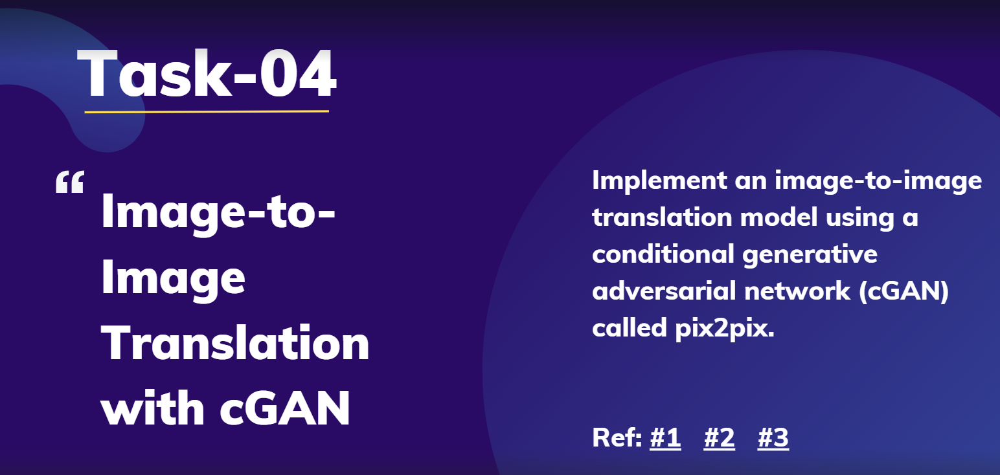

# Image-to-Image Translation with cGAN (pix2pix) 📸✨

## Task Description 📝
This project focuses on implementing an **image-to-image translation** model using a **conditional Generative Adversarial Network (cGAN)**, specifically the **pix2pix** architecture. The goal is to translate images from one domain to another (e.g., converting a sketch to a realistic image or transforming a daytime scene into a nighttime scene).



## Objectives 🎯
- **Develop a cGAN-based image-to-image translation model** using the pix2pix architecture. 🖼️
- **Train the model** on a paired dataset of images, where each pair consists of a **source** and **target** image.
- **Evaluate the model's performance** on unseen test data, assessing the quality and fidelity of the translated images. 🌟

## Requirements 📋
1. **Dataset Preparation**: Obtain a dataset of paired images for the chosen translation task (e.g., edges-to-photo, day-to-night).
2. **Model Architecture**: Implement the **pix2pix cGAN** model, which includes a **generator** and **discriminator** network.
3. **Training**: Train the model on the paired dataset, optimizing for **adversarial** and **reconstruction losses**.
4. **Evaluation**: Assess the model’s performance on test data using metrics like **PSNR** (Peak Signal-to-Noise Ratio) and **SSIM** (Structural Similarity Index), along with qualitative analysis.

## Implementation Steps 🛠️
### 1. Data Preparation 📂
   - Load and preprocess the paired images dataset.
   - Ensure that each **source image** aligns correctly with its **target image** in format and size.

### 2. Model Design 🏗️
   - **Generator**: Create the generator network using an **encoder-decoder** structure with **U-Net** style skip connections.
   - **Discriminator**: Implement the discriminator as a **PatchGAN**, which classifies patches of the image as real or fake, focusing on local features.

### 3. Training Process 🚀
   - Train the model using **alternating updates** for the generator and discriminator.
   - Optimize for the **adversarial loss** (encouraging realistic outputs) and **L1 reconstruction loss** (encouraging similarity to target images).

### 4. Evaluation 📊
   - **Quantitative Evaluation**: Use metrics like PSNR and SSIM to evaluate the fidelity and quality of the generated images.
   - **Qualitative Analysis**: Visually inspect the translated images and compare them to the ground truth to assess realism and details.

## Deliverables 📦
- **Code**: A Python script or Jupyter notebook implementing the pix2pix cGAN for image-to-image translation.
- **Documentation**: This README file, explaining the project’s purpose, methodology, and implementation.
- **Sample Output**: Examples of generated images, showcasing the model's translation quality and performance.

## Sample Code Snippet 🧩
```python
# Import necessary libraries
import tensorflow as tf
from tensorflow.keras import layers

# Define the U-Net Generator
def build_generator():
    inputs = layers.Input(shape=[256, 256, 3])

    # Encoder (downsampling)
    down_stack = [
        downsample(64, 4, apply_batchnorm=False),  # (batch_size, 128, 128, 64)
        downsample(128, 4),  # (batch_size, 64, 64, 128)
        downsample(256, 4),  # (batch_size, 32, 32, 256)
        downsample(512, 4),  # (batch_size, 16, 16, 512)
        downsample(512, 4),  # (batch_size, 8, 8, 512)
        downsample(512, 4),  # (batch_size, 4, 4, 512)
        downsample(512, 4),  # (batch_size, 2, 2, 512)
        downsample(512, 4),  # (batch_size, 1, 1, 512)
    ]

    # Decoder (upsampling)
    up_stack = [
        upsample(512, 4, apply_dropout=True),  # (batch_size, 2, 2, 1024)
        upsample(512, 4, apply_dropout=True),  # (batch_size, 4, 4, 1024)
        upsample(512, 4, apply_dropout=True),  # (batch_size, 8, 8, 1024)
        upsample(512, 4),  # (batch_size, 16, 16, 1024)
        upsample(256, 4),  # (batch_size, 32, 32, 512)
        upsample(128, 4),  # (batch_size, 64, 64, 256)
        upsample(64, 4),   # (batch_size, 128, 128, 128)
    ]

    initializer = tf.random_normal_initializer(0., 0.02)
    last = layers.Conv2DTranspose(3, 4, strides=2, padding='same',
                                  kernel_initializer=initializer,
                                  activation='tanh')  # (batch_size, 256, 256, 3)

    x = inputs
    skips = []
    for down in down_stack:
        x = down(x)
        skips.append(x)
    skips = reversed(skips[:-1])

    for up, skip in zip(up_stack, skips):
        x = up(x)
        x = layers.Concatenate()([x, skip])

    x = last(x)

    return tf.keras.Model(inputs=inputs, outputs=x)

# Instantiate and compile the model
generator = build_generator()
generator.summary()
```

DataSet: https://www.kaggle.com/datasets/srrrrr/edges2shoes 

## References 📚
- [Pix2Pix: Image-to-Image Translation with Conditional Adversarial Networks](https://arxiv.org/abs/1611.07004)
- [Pix2Pix Implementation with PyTorch](https://github.com/junyanz/pytorch-CycleGAN-and-pix2pix)
- [Pix2Pix Implementation with TensorFlow](https://www.tensorflow.org/tutorials/generative/pix2pix)
