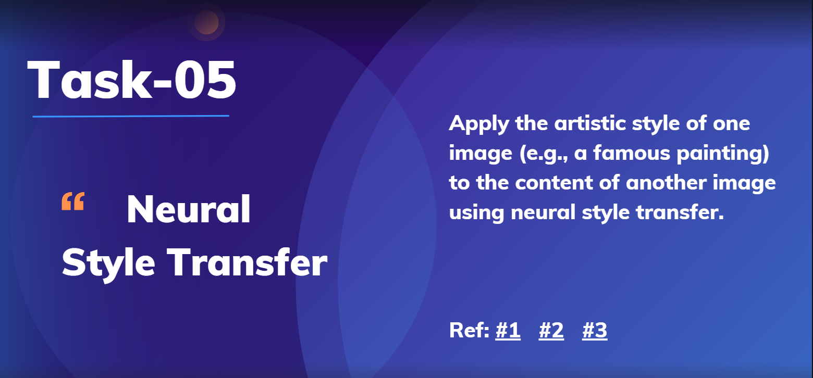

# Task-05: Neural Style Transfer 🖼️✨

## Overview
In this task, I explored **Neural Style Transfer** (NST), a captivating technique in computer vision and deep learning. NST allows the artistic style of one image (such as a famous painting) to be applied to the content of another image, creating a stunning blend. By leveraging convolutional neural networks, this process transforms ordinary photos into extraordinary artworks.



## Objective
The main goal was to merge the style of a renowned painting with the content of a chosen photo, preserving the original image's structure while infusing it with artistic elements.

## Methodology
I implemented NST using TensorFlow, utilizing established tutorials and methods to effectively handle image processing and model construction. By carefully balancing the representations of content and style, I was able to generate visually appealing images that combine the essence of both source images.

## Steps Involved
1. **Prepare the Images**: Select a content image (e.g., a photograph) and a style image (e.g., a famous artwork).
2. **Load the Pre-trained Model**: Use **VGG19**, a convolutional neural network pre-trained on the ImageNet dataset, to extract content and style features.
3. **Define Loss Functions**:
   - **Content Loss**: Evaluates how closely the generated image matches the content of the original image.
   - **Style Loss**: Assesses how well the generated image reflects the style of the reference artwork.
4. **Optimize the Image**: Utilize gradient descent to minimize the combined content and style loss, resulting in the final stylized image.

## Key Resources
- [Geeks for Geeks: Neural Style Transfer with TensorFlow](https://www.geeksforgeeks.org/neural-style-transfer-with-tensorflow/)
- [TensorFlow: Neural Style Transfer Tutorial](https://www.tensorflow.org/tutorials/generative/style_transfer)
- [Towards Data Science: How Neural Style Transfers Work](https://towardsdatascience.com/how-do-neural-style-transfers-work-b76de101eb3)

## Results
The output images showcase the power of neural style transfer, merging the color, texture, and brushstrokes of the chosen style with the structure of the content image. Each generated artwork is unique, highlighting the adaptability of neural networks in creative applications.

## Requirements
- Python 3.x
- TensorFlow
- NumPy
- Matplotlib

## How to Run
1. Clone the repository and navigate to the project folder.
2. Install the required libraries using:
   ```bash
   pip install tensorflow numpy matplotlib
   ```
3. Run the style transfer script:
   ```bash
   python neural_style_transfer.py
   ```
4. View the output images in the specified directory.

## Future Work
Potential next steps include experimenting with different content and style images, adjusting content and style weights for varied results, and exploring alternative models for diverse artistic effects.

## Credits
Special thanks to the following resources for their invaluable guidance:
- [Geeks for Geeks](https://www.geeksforgeeks.org/neural-style-transfer-with-tensorflow/)
- [TensorFlow Style Transfer Tutorial](https://www.tensorflow.org/tutorials/generative/style_transfer)
- [Towards Data Science Article](https://towardsdatascience.com/how-do-neural-style-transfers-work-b76de101eb3)
