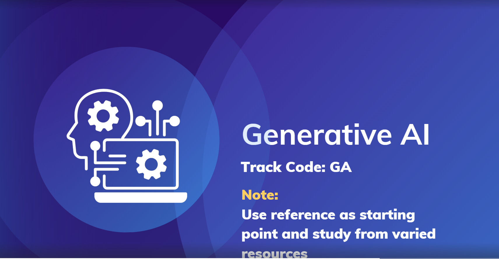

# Generative AI Internship – Prodigy InfoTech 🤖💻

## Overview
I am participating in the **Generative AI Internship** at **Prodigy InfoTech** from October 1st to October 31st, 2024. This internship is designed to provide hands-on experience in Generative AI. 🎉

## Internship Details
- **Duration:** 1 month (October 1st, 2024 to October 31st, 2024) 📆  
- **Role:** Generative AI Intern 🌟  
- **Company:** Prodigy InfoTech 🏢  
- **Location:** Remote 🌐  

## Learning Objectives
During this internship, my goals are to:
- Gain practical skills in working with Generative AI models and techniques. 🤖
- Learn how to fine-tune and optimize Generative AI models for specific use cases. 🔍
- Understand ethical considerations and best practices in Generative AI development. ⚖️
- Contribute to Prodigy InfoTech's ongoing Generative AI projects. 💡
- Develop problem-solving skills and expand my technical knowledge in this field. 🧠

## Internship Activities
Key activities I am involved in include:
- Exploring and experimenting with pre-trained Generative AI models like **DALL-E-mini** and **Stable Diffusion**. 🖌️
- Learning to create text-based prompts for generating relevant and coherent images. 📝🖼️
- Implementing a basic text generation algorithm using **Markov Chains**. 🔢
- Studying **image-to-image translation models** like **cGAN (pix2pix)**. 🖼️➡️🖼️
- Participating in discussions on **Generative AI trends** and advancements. 🎙️
- Collaborating with the Prodigy InfoTech team to apply Generative AI in real-world scenarios. 👥

## References 📚
- [Task List](https://www.canva.com/design/DAFpRxy47kU/w9nxlJ4_CSLwekIRa0ttbg/view?utm_content=DAFpRxy47kU&utm_campaign=designshare&utm_medium=link&utm_source=viewer)

## Conclusion
I am grateful for this opportunity to deepen my skills in Generative AI and look forward to contributing to Prodigy InfoTech's projects. 🙏🚀# PRODIGY_Generative_AI# PRODIGY_Generative_AI
